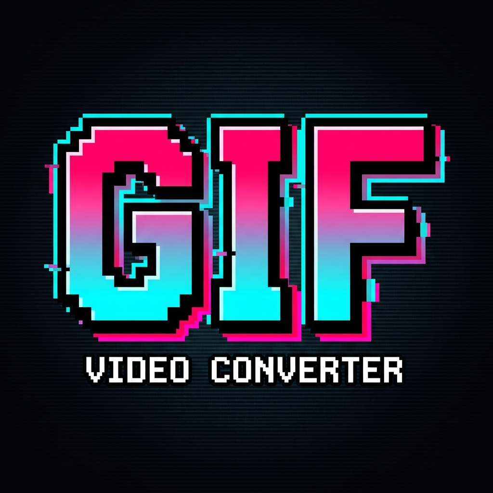
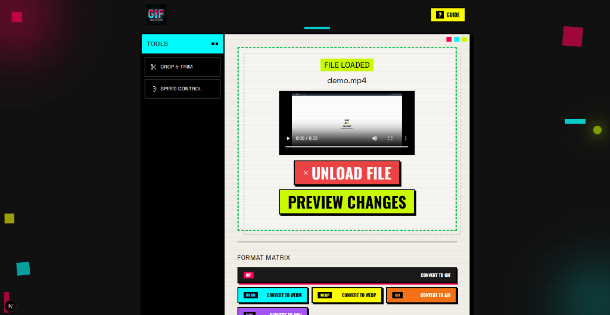

<p align="center">
  
</p>

<h1 align="center">
  
</h1>

<p align="center">
  <strong>Lightning-fast, browser-based video converter. No uploads. 100% private.</strong>
</p>

<p align="center">
  <a href="#features">Features</a> •
  <a href="#demo">Demo</a> •
  <a href="#installation">Installation</a> •
  <a href="#usage">Usage</a> •
  <a href="#formats">Formats</a> •
  <a href="#tech-stack">Tech Stack</a> •
  <a href="#contributing">Contributing</a>
</p>

<p align="center">
  
  
  
  
</p>

<p align="center">
  
  
  
  
</p>

---

## Demo

<p align="center">
  
</p>

<p align="center">
    
  </a>
</p>

---

## Features

<table>
  <tr>
    <td align="center" width="33%">
      <br/>
      <strong>9 Output Formats</strong><br/>
      <sub>GIF, MP4, WebM, WebP, AVI, MOV, MP3, WAV, FLAC</sub>
    </td>
    <td align="center" width="33%">
      <br/>
      <strong>100% Private</strong><br/>
      <sub>Everything runs in your browser. No uploads!</sub>
    </td>
    <td align="center" width="33%">
      <br/>
      <strong>Lightning Fast</strong><br/>
      <sub>Powered by FFmpeg WebAssembly</sub>
    </td>
  </tr>
  <tr>
    <td align="center">
      <br/>
      <strong>Trim & Crop</strong><br/>
      <sub>Set start/end times, crop with presets</sub>
    </td>
    <td align="center">
      <br/>
      <strong>Speed Control</strong><br/>
      <sub>0.5x to 2x playback speed</sub>
    </td>
    <td align="center">
      <br/>
      <strong>Drag & Drop</strong><br/>
      <sub>Easy file upload interface</sub>
    </td>
  </tr>
</table>

---

## Retro UI

<p align="center">
  
</p>

- **Vibrant neon colors** - Pink, Cyan, Lime, Yellow
- **Animated floating shapes** - Retro geometric decorations
- **CRT scanlines** - Authentic retro feel
- **Corner glows** - Pulsing gradient effects
- **Glitch text** - Animated title effects

---

## Supported Formats

### Video Output
| Format | Extension | Description |
|--------|-----------|-------------|
|  | `.gif` | Animated GIF (high quality) |
|  | `.mp4` | H.264 video |
|  | `.webm` | VP8/Vorbis video |
|  | `.webp` | Animated WebP |
|  | `.avi` | MPEG-4 video |
|  | `.mov` | QuickTime video |

### Audio Output
| Format | Extension | Description |
|--------|-----------|-------------|
|  | `.mp3` | MPEG audio |
|  | `.wav` | Lossless PCM audio |
|  | `.flac` | Lossless FLAC audio |

---

## Installation

```bash
# Clone the repository
git clone https://github.com/yourusername/giffy.git

# Navigate to project directory
cd giffy

# Install dependencies
npm install

# Start development server
npm run dev
```

Open [http://localhost:3000](http://localhost:3000) in your browser.

---

## Tech Stack

<p align="center">
  
</p>

| Technology | Purpose |
|------------|---------|
| **Next.js 15** | React framework with App Router |
| **TypeScript** | Type-safe development |
| **Tailwind CSS** | Utility-first styling |
| **FFmpeg.wasm** | Browser-based video processing |
| **React Hooks** | State management |

---

## Project Structure

```
giffy/
├── app/
│   ├── layout.tsx      # Root layout with meta tags
│   ├── page.tsx        # Main application
│   └── globals.css     # Global styles & animations
├── public/
│   ├── logo.png        # App logo
│   ├── social-cover.png # Social media preview
│   └── manifest.json   # PWA manifest
└── package.json
```

---

## Contributing

Contributions are welcome! Please feel free to submit a Pull Request.

1. Fork the project
2. Create your feature branch (`git checkout -b feature/AmazingFeature`)
3. Commit your changes (`git commit -m 'Add some AmazingFeature'`)
4. Push to the branch (`git push origin feature/AmazingFeature`)
5. Open a Pull Request

---

## License

This project is licensed under the MIT License - see the [LICENSE](LICENSE) file for details.

---

<p align="center">
  
</p>

<p align="center">
  <a href="https://github.com/yourusername/giffy/stargazers">
    
  </a>
</p>
